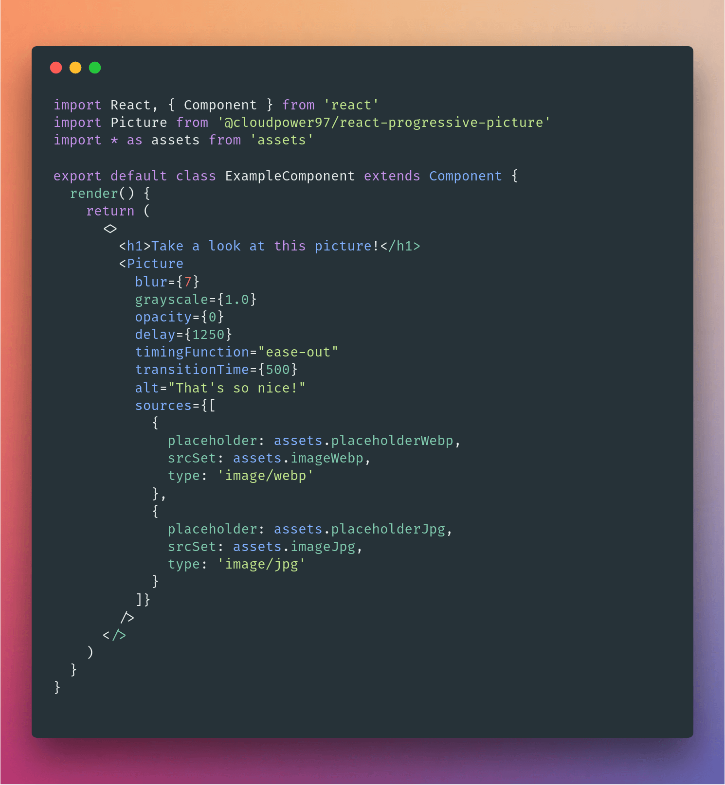

# React Progressive Picture

[](https://reactjs.org/)
[](https://github.com/prettier/prettier)
[](https://GitHub.com/CloudPower97/react-progressive-picture/releases/)
[](https://GitHub.com/CloudPower97/react-progressive-picture/graphs/contributors/)
[](http://makeapullrequest.com)
[](https://opensource.org/licenses/MIT)

[](https://travis-ci.com/CloudPower97/react-progressive-picture)
[](https://www.codacy.com/app/claudio.cortese/react-progressive-picture?utm_source=github.com&utm_medium=referral&utm_content=CloudPower97/react-progressive-picture&utm_campaign=Badge_Grade)
[](https://www.codacy.com/app/claudio.cortese/react-progressive-picture?utm_source=github.com&utm_medium=referral&utm_content=CloudPower97/react-progressive-picture&utm_campaign=Badge_Coverage)

<details>
<summary><strong>Table of Contents</strong></summary>

- [Overview](#overview)
- [Installation](#installation)
- [Why use this component?](#why-use-this-component)
- [Documentation](#documentation)
  - [Usage](#usage)
  - [Options](#options)
- [Polyfill](#polyfill)
- [Contributing](#contributing)
  - [Development](#development)
  - [Linter](#linters)
  - [Testing](#testing)
  - [Commit Guidelines](#commit-guidelines)

</details>

---

## Overview

<p align="center">
  
</p>

**React Progressive Picture** is the right way to handle the lazy loading of your `img` or `picture` element inside a `React` application.

It's highly customizable, support different placeholder based on sources, advanced _CSS_ `filter` effects and a lot more to make your design just the way you want it!

---

## Installation

`npm i @cloudpower97/react-progressive-picture`

or

`yarn add @cloudpower97/react-progressive-picture`

> You also want to add the
> [intersection-observer](https://www.npmjs.com/package/intersection-observer)
> and/or [picturefill](https://www.npmjs.com/package/picturefill)
> polyfill for full browser support. Check out adding the [polyfill](#polyfill)
> for details about how you can include it.

---

## Why use this component?

There are already some component out there that you can use to lazyload images OR to support the latest `<picture>` specification.

**React Progressive Picture** itself has been inspired by such components,
as [`react-progressive-image-loading`](https://github.com/wcandillon/react-progressive-image-loading) and [`react-responsive-picture`](https://github.com/braposo/react-responsive-picture).

For example `react-progressive-image-loading` doesn't allow you to use the `<picture>` element and `react-responsive-picture` hasn't any option for lazy loading.

I was seeking the best of both world, so I started the development of **React Progressive Picture**.

Here are some key feature of **React Progressive Picture**:

- _TDD_ led to the creation of an high quality code with 100% of test coverage
- Using the _Intersection Observer API_ to know exactly when to lazyload your beautiful images, makes **React Progressive Picture** performance friendly.
  - It actually uses [`react-intersection-observer`](https://github.com/researchgate/react-intersection-observer) behind the scenes, which is another high quality component which has 100% of test coverage as well
- Define multiple placeholders based on source type or a single placeholder for all of your sources (Useful when you use technique like [`SQIP`](https://github.com/technopagan/sqip)).
- Create advanced effects with _CSS_ `filter` and apply them to create you unique loading effects.
- Control the `timing function` and the `transition time` to achieve exactly what you have in mind.
- Lazy load an image after a custom _delay_.
- Automatically add a default empty alt tag (also called the NULL alttext)to every image, implying they are just decorative images that serves no specific purpose.
  [This is done for accessibility purposes](https://developer.mozilla.org/en-US/docs/Web/HTML/Element/picture#Usage_notes).
- It simulates Medium progressive image loading out of the box with no configuration needed.

---

## Documentation

<!-- TODO: Add Demo section -->

### Usage



> You can find more example in the `example` folder.

---

### Options

|    property    | propType | required | default |                                                          description                                                          |
| :------------: | :------: | :------: | :-----: | :---------------------------------------------------------------------------------------------------------------------------: |
|    sources     |  array   |  false   |    -    |                       The array of source objects specifies multiple media resources for the <picture>                        |
|  placeholder   |  string  |  false   |    -    |                                         Placeholder image to show until the src loads                                         |
|      src       |  number  |   true   |    -    |                                                         The image URL                                                         |
|      alt       |  string  |   true   |   ''    |                                     Defines an alternative text description of the image.                                     |
|     sizes      |  string  |  false   |    -    |                       Sizes attribute to be used with src for determing best image for user's viewport.                       |
| transitionTime |  number  |   true   |   750   |                                         Time in millisecond to transition the effects                                         |
| timingFunction |  string  |   true   | 'ease'  |                                            Timing function to use for the effects                                             |
|      blur      |  number  |  false   |   10    |                                               Initial value for the blur filter                                               |
|   grayscale    |  number  |  false   |    0    |                                            Initial value for the grayscale filter                                             |
|    opacity     |  number  |  false   |    1    |                                             Initial value for the opacity filter                                              |
|     filter     |  string  |  false   |    -    | The filter CSS property to applies graphical effects. Read more here: https://developer.mozilla.org/en-US/docs/Web/CSS/filter |
|     delay      |  number  |  false   |    0    |                                        Time in milliseconds before src image is loaded                                        |
|    options     |  object  |  false   |    -    |           react-intersection-observer options: https://github.com/researchgate/react-intersection-observer#options            |

---

## Contributing

> Yes please!

Pull requests and [reporting an issue](https://github.com/CloudPower97/react-progressive-picture/issues) are always welcome :D

### Development

Fork and clone the repo:

`git clone git@github.com:your-username/react-progressive-picture.git`

Create a branch for the feature/fix:

`git checkout -b feat:new-great-idea`

Then:

`npm run dev`

or

`yarn dev`

to automatically spin up a webpack dev server and see your changes as you make them in the `src` folder!

Once you are done, push to your fork and submit a pull request.

And remember,


#### Linters

<p align="center">


</p>

To enforce a consistent style across the entire project we are using [`Prettier`](https://prettier.io/).

We are also using [`ESLint`](https://eslint.org/) to catch bugs and syntax errors during development.

We run `Prettier` and `ESLint` before each commit thanks to [`Husky`](https://github.com/typicode/husky), so that you can focus on what matter the most : writing code.

Please, note that you will not be able to commit/push any changes you made if your code doesn't pass any of the linting stage described above.

In that case check your `git-log` and fix any problem reported there.

Also note that by default `ESLint` will try to fix any problems it can fix by itself.

It will bother you only for changes it can't fix.

All of the above assure us that our code base is always consistent with the rules we are using and bug free as much as possible.

#### Testing

<p align="center">
  
  
</p>

We are using [`Jest`](https://github.com/facebook/jest) and [`Enzyme`](https://github.com/airbnb/enzyme) to test our components.

We also utilizes `cypress` to handle some edge cases which are hard to test otherwise.

#### Commit Guidelines

We follow the [Angular Commit Guidelines](https://github.com/angular/angular.js/blob/master/DEVELOPERS.md#commits).

Refer to their documentation for more information.

Note: If you DON'T follow the [Angular Commit Guidelines](https://github.com/angular/angular.js/blob/master/DEVELOPERS.md#commits) you will not be able to commit your changes.

---

## Intersection Observer

[Intersection Observer](https://developer.mozilla.org/en-US/docs/Web/API/Intersection_Observer_API)
is the _API_ used to determine if an element is inside the viewport or not.

> [Can i use intersectionobserver?](https://caniuse.com/#feat=intersectionobserver)

## Picture

> [Can i use picture?](https://caniuse.com/#feat=picture)

---

## Polyfill

You can import the
[intersection-observer](https://www.npmjs.com/package/intersection-observer)
and/or [picturefill](https://www.npmjs.com/package/picturefill) directly or use
a service like [polyfill.io](https://polyfill.io/v2/docs/) to add it when
needed.

```sh
yarn add intersection-observer picturefill
```

Then import it in your app:

```js
import 'intersection-observer'
import 'picturefill'
```
